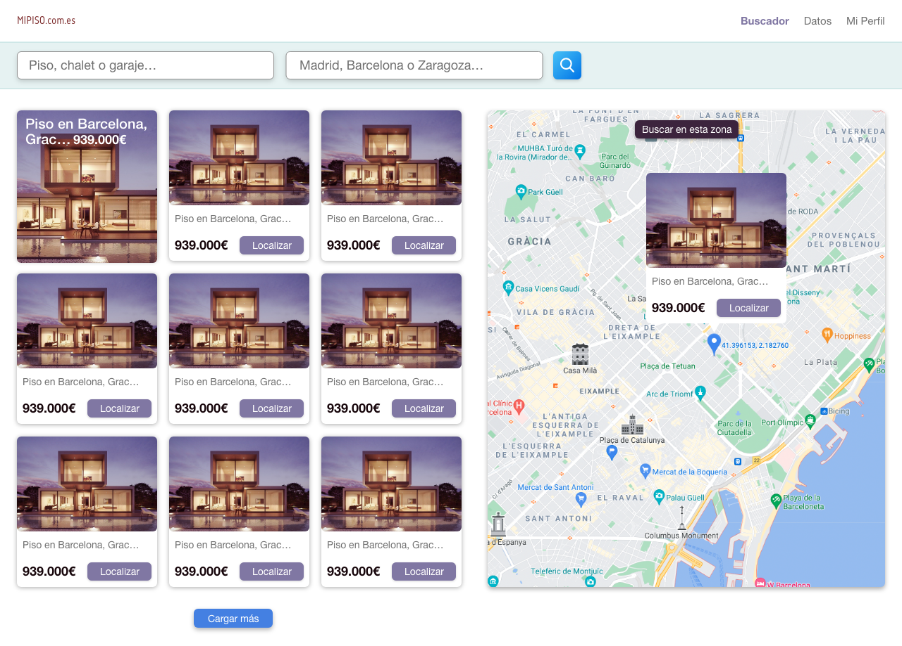

# Módulo 2: Tarea Final

Prácticaque intenta recrear el siguiente diseño con React, utilizando Styled Components y un diseño atómico.
   

### Instrucciones

- `npm i`
- `npm run dev`

### [CodeSandBox](https://codesandbox.io/p/github/eliashz/ra-m2-tarea-final/draft/red-forest)

### Documentación

- [Styled Components](https://styled-components.com/)
- [Modern Normalize](https://github.com/sindresorhus/modern-normalize)
- [Grid](https://css-tricks.com/snippets/css/complete-guide-grid/)
